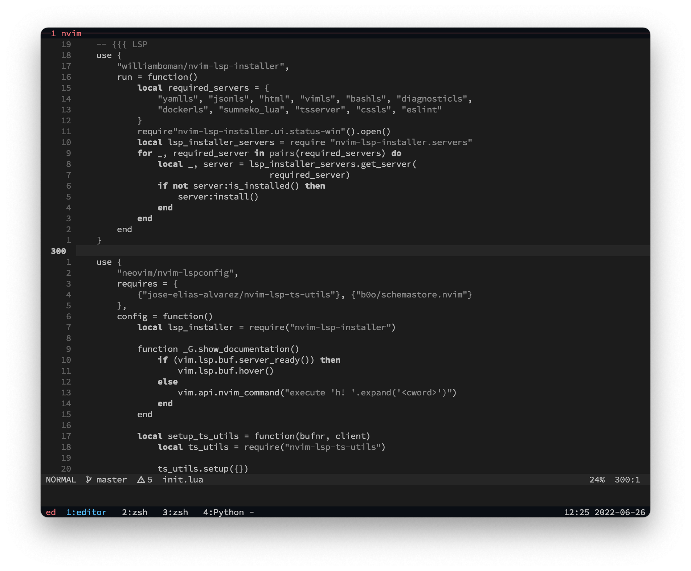

# Personal Development Envionment

* [Personal Development Envionment](#personal-development-envionment)
   * [Workflow](#workflow)
      * [Prerequisites](#prerequisites)
      * [Tmux + FZF](#tmux--fzf)
      * [Neovim](#neovim)
         * [Basic movement](#basic-movement)
         * [LSP](#lsp)
         * [Git inside neovim](#git-inside-neovim)
   * [Installation](#installation)
      * [Homebrew](#homebrew)
      * [Stow](#stow)
   * [Goal](#goal)
   * [Non-Goal](#non-goal)



## Workflow

I'll show serveral keymaps for daily basis workflow (not all keymaps)

Start a coding session with tmux

```sh
tmux
```

### Prerequisites
- Set `WORKSPACE_FOLDER` to your folder containing your projects
- Set `DOTFILES` to your dotifles folder


### Tmux + FZF

By setting `WORKSPACE_FOLDER` in the `.zshrc` file, navigates between project become eaziser when combines
with `fzf`

Mappings:
- `fw` show list of folder under `WORKSPACE_FOLDER`. Press `Enter` will `cd` into that folder
- `ff` show list of folder under `WORKSPACE_FOLDER`. Press `Enter` will `cd` into that folder, and open `nvim`
- `fff` show list of folder under `WORKSPACE_FOLDER`. Press `Enter` will `cd` into that folder, open `nvim`, and change the `tmux` window's name by the current directory's name


- `dot` will cd to `DOTFILES` folder, open `nvim` and set tmux window to folder's name

- `c-a` + `o` will close all panes in current window
- `c-a` + `O` (capital `O`) will close all window in current session and re-index current window to `1`


### Neovim
#### Basic movement

- `space` + `o`: open fuzzy finder


- `space` + `i`: open list of open buffers


- `space` + `n`: toggle explorer tree


- `space` + `space` + `f` + `c`: open theme chooser, first choose theme, then choose variant


- `space` + `space` + `f` + `h`: open help fuzzy finder


- `space` + `k` + `m`: open key map fuzzy finder


- `space` + `/`: fuzzy search current buffer


#### LSP

- `space` + `f` + `m`: format current buffer
- `space` + `a` + `c`: show code action


- `space` + `l` + `d`: show diagnostics

- `K`: hover


#### Git inside neovim

- `space` + `h` + `c`: show diff current hunk


- `]` + `c`: go to next hunk
- `[` + `c`: go to previous hunk
- `space` + `h` + `a`: stage current hunk
- `space` + `h` + `A`: stage whole current buffer
- `space` + `h` + `d`: reset current hunk
- `space` + `h` + `D`: reset whole current buffer
- `space` + `b` + `l`: show floating blame

- `space` + `space` + `b` + `l`: show whole buffer blame


## Installation

### Homebrew

```sh
  git clone https://github.com/Homebrew/brew.git ~/homebrew
```

then (add this to your shell profile)

```sh
  export PATH="$PATH:$HOME/homebrew/bin"
```

### Stow

Make sure you installed [stow](https://formulae.brew.sh/formula/stow)

```sh
brew install stow
```

After that, just clone my repo to your home directory

```sh
cd ~ && git clone https://github.com/annguyenwasd/dotfiles.git && cd ~/dotfiles && rm -rf .non-stow && stow . && git stash -u
```

if you just want to use neovim, just

```sh
stow neovim
```

## Goal

- Minimalism
- Speed
- Fun
- Fully personal customization

## Non-Goal
- Become an IDE
- Alternative pre-configured repos: Lunar.nvim, Astro.nvim, etc.

## Issues
- LSP not started in a single file
- Diagnostic not working with javascript file
- Find text in specific folder
